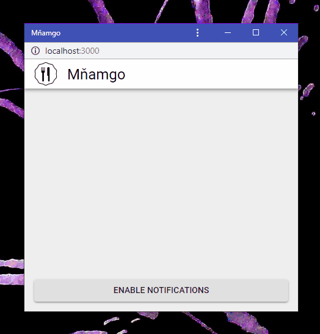

# PWA push subscription handler

Handling PWA push notifications subscription flow made easier. [MDN docs](https://developer.mozilla.org/en-US/docs/Web/API/PushManager)

## Installation

`npm install --save-dev pwa-push-subscription-handler`

## Usage

### HTML

```html
<button role="button" id="pushToggleButton" style="display: none;"></button>
```

### JavaScript

```javascript
import { PwaPushSubscriptionHandler } from 'pwa-push-subscription-handler'

const $button = document.querySelector('#pushToggleButton')

const publishSubscription = async (subscription: PushSubscription) => {
	// Send user's subscription object to your server and save it
	return fetch('http://example.com/submit/', {
		method: 'POST',
		body: JSON.stringify(subscription),
	})
}

const unpublishSubscription = async () => {
	// Let your server know user's user agent won't accept any new notifications
	return
}

const pwaPushSubscriptionHandler = new PwaPushSubscriptionHandler(
	'***', // Public Vapid key - see https://www.npmjs.com/package/web-push
	publishSubscription,
	unpublishSubscription // May be omitted
)

pwaPushSubscriptionHandler.addListener((state) => {
	// state = 'loading' | 'updating' | 'not-supported' | 'disabled' | 'not-subscribed' | 'subscribed' | 'error'

	$button.style.display = ['disabled', 'not-supported'].includes(state)
		? 'none'
		: 'inline-block'

	$button.setAttribute(
		'disabled',
		['loading', 'updating', 'error'].includes(state)
	)

	switch (state) {
		case 'subscribed':
			$button.innerText = 'Disable notifications'
			break
		case 'not-subscribed':
			$button.innerText = 'Enable notifications'
			break
		default:
			$button.innerText = 'Loading'
	}
})

$button.addEventListener('click', pwaPushSubscriptionHandler.toggle})
```

### Screencast



### State

- `'subscribed'` - user is subscribed - show button "Disable notifications"
- `'not-subscribed'` - user is not yet subscibed or has unsubscribed - show button "Enable notifications"
- `'updating'` - transitioning between subscribed and not-subscribed - disable button, show loading indicator
- `'loading'` - waiting for service worker (may not finish on the first page load) - hide button
- `'disabled'` - user/browser blocked notifications - hide button
- `'not-supported'` - browser doesn't support push notifications - hide button
- `'error'` - something went wrong, button won't work correctly - hide or disable button
